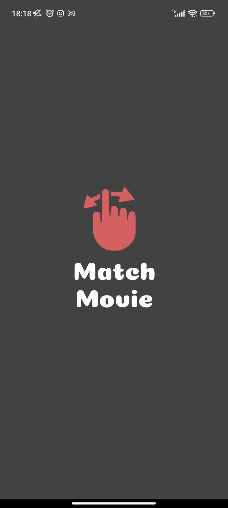
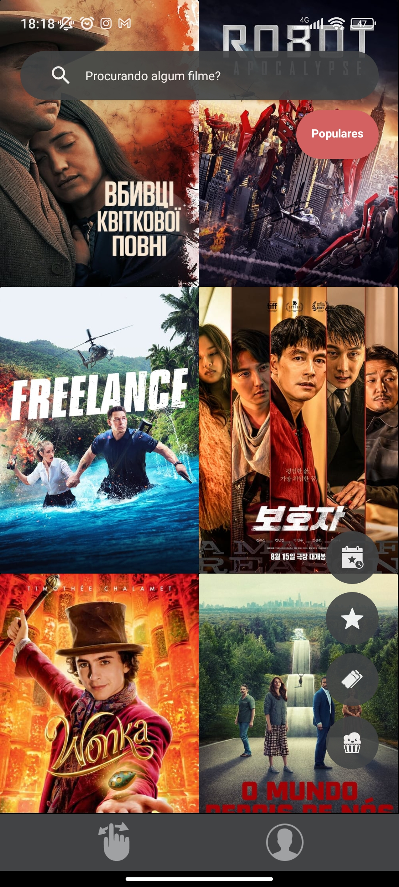
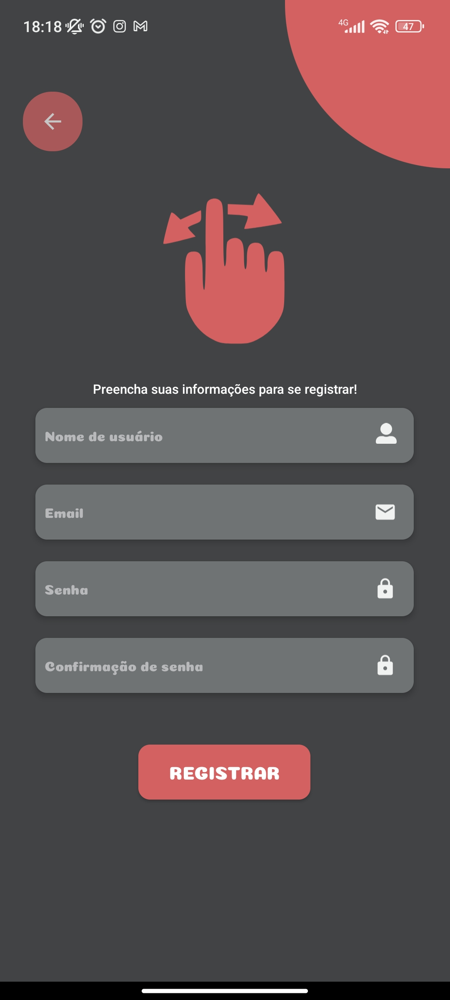
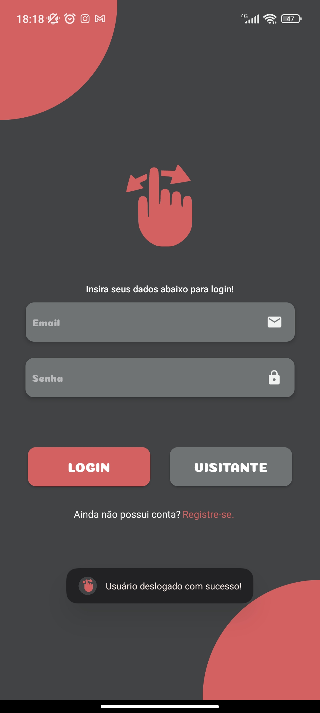
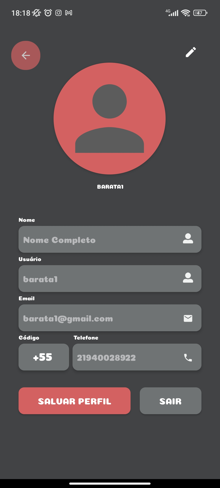
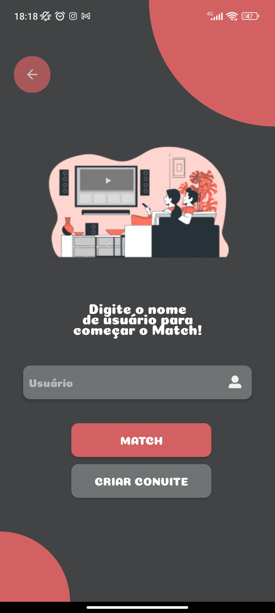

 

#

Aplicativo mobile feito em JAVA utilizando MVVM com REST API e Retrofit. 

A escolha de filmes nunca foi tão fácil!

 
 

# Sobre 📜

O aplicativo ainda está em desenvolvimento, mas sua ideia é funcionar como 2 funções principais: servir como um catálogo de filmes e como uma forma de escolher um filme para assistir através de um 'tinderlike' jogo. 

O 'tinderlike' jogo funcionaria da seguinte forma: dois usuários se conectariam para curtir e descurtir diversos filmes (baseado em um filtro da escolha de ambos), arrastando pra direita e para esquerda, achando um denomiandor comum, quando ambos derem like no mesmo filme.

Foi utilizada a API do [themoviedb.org](https://www.themoviedb.org/) com Retrofit para a disponibilização de filmes no catálogo.

